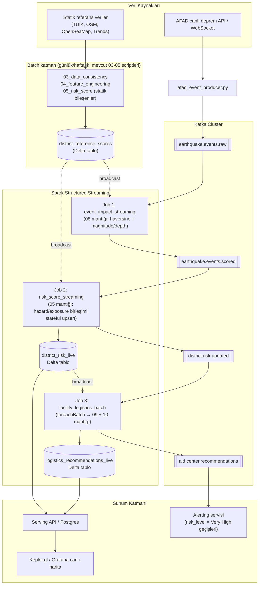

# Marmara Deprem Risk & Yardım Merkezi — Streaming Mimarisi

Mevcut batch pipeline'ınız (03_data_consistency → 10_logistics_recommendation) günlük/
manuel çalışan bir toplu iş zinciriydi. Bu tasarım aynı iş mantığını koruyarak onu
**canlı deprem verisiyle sürekli güncellenen** bir sisteme dönüştürür.

## Temel prensip: statik vs dinamik veriyi ayır

Skorlama modelinizde iki tür girdi var:

- **Statik / yavaş değişen** (population, OSM altyapı, OpenSeaMap, Google Trends
  farkındalık) → bunları streaming'e sokmaya gerek yok. Günlük/haftalık batch job
  olarak kalır (03/04 script'leri), sonucu bir **referans tablosu** (Delta/Parquet)
  olarak yazılır ve Spark job'ları bunu **broadcast join** ile kullanır.
- **Dinamik / olay bazlı** (deprem event'leri) → Kafka + Spark Structured Streaming
  ile gerçek zamanlı işlenir.

Bunu ayırmazsanız her deprem mikro-batch'inde tüm OSM/nüfus verisini yeniden
işlemeye çalışırsınız — gereksiz ve yavaş.

## Topoloji



## Kafka topic tasarımı

| Topic | Key | Partition stratejisi | İçerik |
|---|---|---|---|
| `earthquake.events.raw` | `event_id` | 3-6 partition, event zamanına göre sıralı değil | Ham AFAD event'i |
| `earthquake.events.scored` | `province_key:district_key` | district'e göre | event × ilçe etki skoru (08'in streaming hali) |
| `district.risk.updated` | `province_key:district_key` | district'e göre | Güncellenmiş final_risk_score + risk_level (sadece değişenler) |
| `aid.center.recommendations` | `event_id` | event'e göre | Aktive edilecek tesisler + ilçe atamaları |

Şema kaydı için Avro + Schema Registry öneririm (JSON da olur ama prod'da şema
uyumsuzluğu erken yakalamak için Avro daha güvenli).

## Spark job'larının mantığı

**Job 1 — event_impact_streaming**: `earthquake.events.raw`'ı okur, statik
`district_reference_scores` tablosunu broadcast join ile bağlar, her ilçe için
08_event_impact.py'deki haversine + magnitude/depth/distance formülünü uygular.
Watermark yok çünkü her event bağımsız (state biriktirmiyoruz).

**Job 2 — risk_score_streaming**: `earthquake.events.scored`'ı okur. Statik
hazard/exposure/infrastructure/preparedness/response bileşenlerini (05'te zaten
hesaplanmış) `weighted_earthquake_count`'un canlı güncellemesiyle yeniden ağırlıklandırır.
`foreachBatch` ile Delta tabloya **MERGE (upsert)** yapar — bu stateful ama Spark'ın
kendi state store'una değil, Delta'nın ACID merge'ine güveniyoruz (yeniden başlatmada
daha sağlam).

**Job 3 — facility_logistics_batch**: `district.risk.updated`'daki her mikro-batch'te
hangi event/district'lerin değiştiğini görür, 09_facility_ranking.py ve
10_logistics_recommendation.py'deki fonksiyonları **olduğu gibi import edip** sadece
etkilenen event_id'ler için yeniden çalıştırır (tüm sistemi değil). Bu, mevcut
kodunuzu yeniden yazmak yerine yeniden kullanmanın anahtarı.

## Neden bu şekilde ayırdım

- 09 ve 10'daki fonksiyonlar (facility hazırlama, safety/access skorlama) zaten saf
  pandas fonksiyonları — bunları Spark'a taşımaya gerek yok, sadece **her mikro-batch'te
  tetiklenen bir Python fonksiyonu** olarak `foreachBatch` içinde çağırıyoruz. OSM tesis
  sayısı (havalimanı, liman vb. — birkaç bin satır) Spark'ın dağıtık işleme gücünü
  gerektirmeyecek kadar küçük.
- Gerçek dağıtık işleme gereken kısım: çok sayıda ilçe × çok sayıda eşzamanlı event
  (deprem fırtınası / artçı seri senaryosu) olduğunda Job 1 ve Job 2'deki join'ler.

## Deployment (OpenStack/Kubernetes altyapınıza uygun)

Türk Telekom'daki OpenStack/OpenShift deneyiminizle örtüşecek şekilde:

- **Strimzi Operator** ile Kafka cluster'ı Kubernetes/OpenShift üzerinde yönetin
  (KRaft mode, Zookeeper'sız — daha az operasyonel yük)
- **Spark Operator** (GCP'nin `spark-on-k8s-operator`'ı) ile streaming job'ları
  Kubernetes native olarak çalıştırın, `spark-submit --master k8s://...`
- Delta tablolarını MinIO (S3 uyumlu, OpenStack Swift üzerine de kurulabilir) üzerinde
  tutabilirsiniz
- Yerel geliştirme için ekteki `docker-compose.yml` yeterli

## Klasör yapısı

```
marmara-streaming/
├── ARCHITECTURE.md
├── docker-compose.yml
├── requirements.txt
├── producers/
│   └── afad_event_producer.py       # AFAD'dan Kafka'ya
├── streaming/
│   ├── event_impact_streaming.py    # Job 1
│   ├── risk_score_streaming.py      # Job 2
│   └── facility_logistics_batch.py  # Job 3
└── common/
    ├── reference_data.py            # statik veri yükleme/broadcast
    ├── facility_ranking.py          # 09'dan taşınan fonksiyonlar (import edilir)
    └── logistics_recommendation.py  # 10'dan taşınan fonksiyonlar (import edilir)
```

version: "3.8"

# Yerel geliştirme ortamı: tek-node Kafka (KRaft, Zookeeper'sız) + Spark master/worker.
# Prod'da Strimzi (Kafka) ve Spark Operator (Kubernetes) kullanın — bkz. ARCHITECTURE.md

services:
  kafka:
    image: confluentinc/cp-kafka:7.6.1
    container_name: kafka
    ports:
      - "9092:9092"
    environment:
      KAFKA_NODE_ID: 1
      KAFKA_PROCESS_ROLES: broker,controller
      KAFKA_LISTENERS: PLAINTEXT://kafka:29092,CONTROLLER://kafka:29093,PLAINTEXT_HOST://0.0.0.0:9092
      KAFKA_ADVERTISED_LISTENERS: PLAINTEXT://kafka:29092,PLAINTEXT_HOST://localhost:9092
      KAFKA_CONTROLLER_LISTENER_NAMES: CONTROLLER
      KAFKA_LISTENER_SECURITY_PROTOCOL_MAP: CONTROLLER:PLAINTEXT,PLAINTEXT:PLAINTEXT,PLAINTEXT_HOST:PLAINTEXT
      KAFKA_CONTROLLER_QUORUM_VOTERS: 1@kafka:29093
      KAFKA_OFFSETS_TOPIC_REPLICATION_FACTOR: 1
      CLUSTER_ID: "marmara-dev-cluster-01"
    volumes:
      - kafka-data:/var/lib/kafka/data

  kafka-ui:
    image: provectuslabs/kafka-ui:latest
    container_name: kafka-ui
    ports:
      - "8080:8080"
    environment:
      KAFKA_CLUSTERS_0_NAME: local
      KAFKA_CLUSTERS_0_BOOTSTRAPSERVERS: kafka:29092
    depends_on:
      - kafka

  spark-master:
    image: bitnami/spark:3.5
    container_name: spark-master
    environment:
      - SPARK_MODE=master
    ports:
      - "7077:7077"
      - "8081:8080"   # Spark UI
    volumes:
      - ./:/opt/marmara-streaming
      - ./data:/opt/marmara-streaming/data

  spark-worker:
    image: bitnami/spark:3.5
    container_name: spark-worker
    environment:
      - SPARK_MODE=worker
      - SPARK_MASTER_URL=spark://spark-master:7077
      - SPARK_WORKER_MEMORY=2G
      - SPARK_WORKER_CORES=2
    depends_on:
      - spark-master
    volumes:
      - ./:/opt/marmara-streaming
      - ./data:/opt/marmara-streaming/data

volumes:
  kafka-data:

# Marmara Deprem Risk & Yardım Merkezi — Streaming

Mevcut batch pipeline'ınızı (03-10) canlı Kafka + Spark mimarisine taşıyan proje.
Detaylı mimari için `ARCHITECTURE.md`'ye bakın.

## Yerel hızlı başlangıç

```bash
# 1) Kafka + Spark cluster'ı ayağa kaldır
docker-compose up -d
bash deploy/create_topics.sh

pip install -r requirements.txt

# 2) Statik referans verisini hazırla (mevcut batch scriptleriniz + Delta'ya yazma)
#    03/04/05'i normal şekilde çalıştırıp çıktısını common/reference_data.py'deki
#    refresh_reference_table() ile Delta'ya yazdırın. Ayrıca 09'un ihtiyaç duyduğu
#    osm_critical_points_clean.csv ve district_risk_scores.csv dosyalarının
#    data/processed/ altında olduğundan emin olun (facility_logistics_batch.py bunları okur).

# 3) Producer'ı test/demo modunda başlat (gerçek AFAD yerine 3 örnek senaryo yayınlar)
python producers/afad_event_producer.py --simulate --poll-interval 20

# 4) Üç streaming job'u ayrı terminallerde başlat
spark-submit --master spark://localhost:7077 \
  --packages org.apache.spark:spark-sql-kafka-0-10_2.12:3.5.1,io.delta:delta-spark_2.12:3.2.0 \
  streaming/event_impact_streaming.py

spark-submit --master spark://localhost:7077 \
  --packages org.apache.spark:spark-sql-kafka-0-10_2.12:3.5.1,io.delta:delta-spark_2.12:3.2.0 \
  streaming/risk_score_streaming.py

spark-submit --master spark://localhost:7077 \
  --packages org.apache.spark:spark-sql-kafka-0-10_2.12:3.5.1,io.delta:delta-spark_2.12:3.2.0 \
  streaming/facility_logistics_batch.py

# 5) Sonuçları izle
#    - Kafka UI: http://localhost:8080 (aid.center.recommendations topic'ini izleyin)
#    - Spark UI: http://localhost:8081
#    - data/reference/district_risk_live ve logistics_recommendations_live Delta tabloları
```

## Prodüksiyona geçiş için yapılacaklar

1. `--simulate` yerine gerçek AFAD polling'i doğrulayın (endpoint şeması zamanla değişebilir).
2. `RISK_LEVEL_THRESHOLDS` (risk_score_streaming.py) ve OSM/risk statik dosya yollarını
   (facility_logistics_batch.py) periyodik batch job çıktılarınızla senkron tutacak bir
   Airflow DAG'i kurun.
3. Docker Compose yerine Strimzi (Kafka) + Spark Operator ile Kubernetes/OpenShift'e taşıyın
   — bkz. `ARCHITECTURE.md` → Deployment bölümü.
4. `LIVE_IMPACT_WEIGHT`'in zamanla "sönmesi" (decay) için ayrı bir saatlik job ekleyin;
   şu anki haliyle bir deprem etkisi sonsuza kadar risk skorunu etkilemeye devam eder.
5. Schema Registry + Avro'ya geçin (şu an ham JSON kullanılıyor, prod'da şema doğrulaması önemli).

pyspark==3.5.1
delta-spark==3.2.0
confluent-kafka==2.5.0
pandas==2.2.2
numpy==1.26.4
requests==2.32.3
